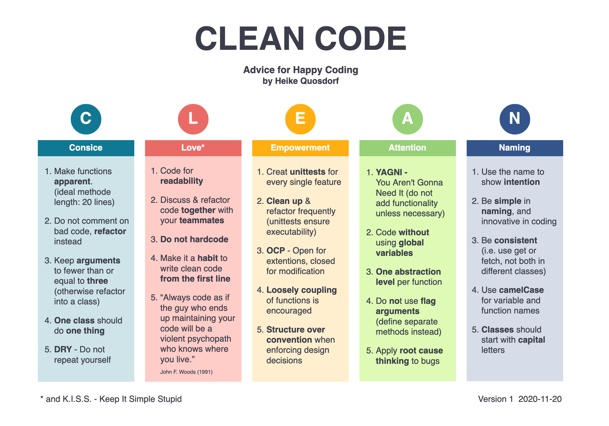

# Apply CleanCode 

As this bundle of data analysis code grew to the medium size collection of a python scripts, it is perfect for a little Clean Code exercise.  
The following steps where applied in order to create a easy to use and clean python application.

## PHASE 1

Some steps to create a nice ditigal working environment for a clean start:
- initialise a git repository for version controll and link it to a remote URL
- create and/or activate your virtual environment for this project
- move working files out of this repository (*.ipynb) or at least
- create a <.gitignore> file do hide certain file (like notes.txt etc.) from git version controll
- draw diagram to plan code structure
- tea break

## STEP 2

Now its about time to dig into this code collection of yours and start cleaning!
- delet unused imports
- restructure code as planed
- create python classes and modules to include all previously scattered processing functionality
- get rid of redundant / duplicate code
- make all function names camelCase
- rename variables to show there intention
- delet unnecessary functionality  
  (like the processing of "global max", "global min" "global mean" and "global average" values in the example code)
- deleted unnecessary columns from dataframe 
  ("also", "dm tools", "target" and "size" values in the example code)
- more tea

## STEP 3

- write unittests
- solve bugs
- add main.py script to inherit all processing functionality
- add command line interface for easy handling
- solve more bugs
- add documentation to functions and classes
- write requirements.txt to collect used python libraries
- write basic user instructions in README.md file for your git repository

